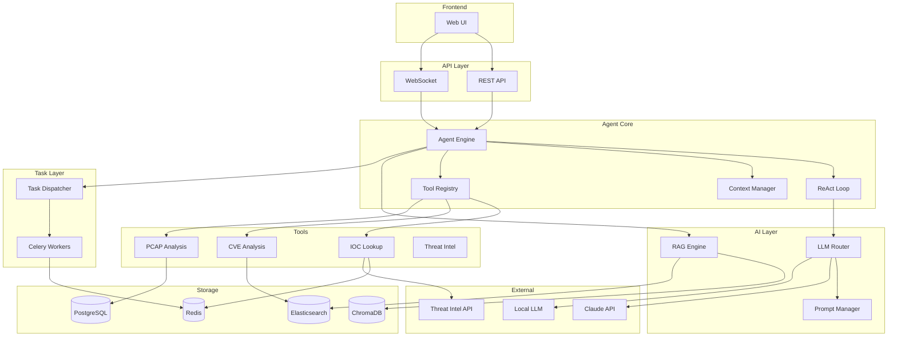

# Architecture Graph

> 系统模块依赖关系图。Agent 对图结构比长文档更敏感。

## 系统架构总览



## 模块依赖矩阵

| 模块 | 依赖 | 被依赖 |
|------|------|--------|
| Agent Engine | ToolRegistry, ContextMgr, Router, Dispatcher | REST, WS |
| LLM Router | PromptMgr, ClaudeAPI, LocalLLM | Agent, ReAct |
| Tool Registry | IOC, CVE, PCAP | Agent |
| Context Manager | Redis | Agent, ReAct |
| RAG Engine | Chroma, ES | Agent |
| Task Dispatcher | Celery, Redis | Agent |
| Prompt Manager | (文件系统) | Router |

## 数据流

### 用户查询 → Agent 响应

```
User → REST/WS → Agent → ReAct Loop:
  → Think (LLM Router → Claude API)
  → Act (Tool Registry → Tool 执行)
  → Observe (结果结构化)
  → (循环直到完成)
→ Response → User
```

### 异步任务流

```
Agent → Task Dispatcher → Redis Queue → Celery Worker → Tool 执行 → 结果回写
```
